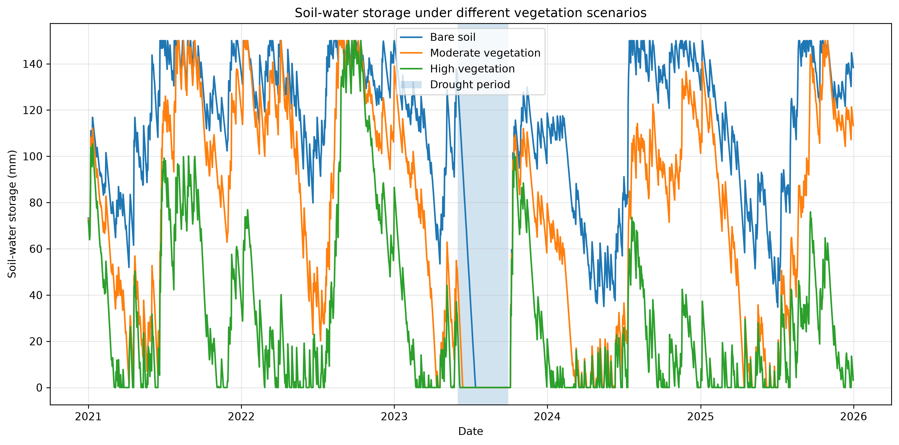
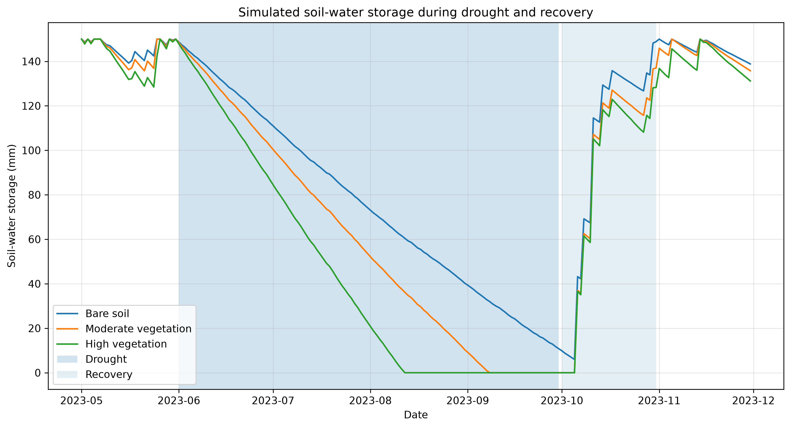
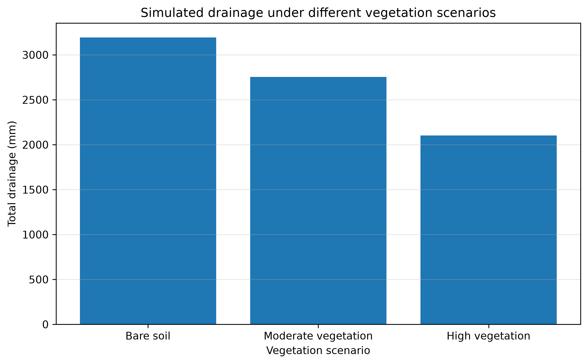

# Dry-Period Soil–Water Dynamics

## Overview

A small Python-based computational proof-of-concept examining how vegetation water demand affects soil-water storage and drainage during a dry period and subsequent rainfall recovery.

The model uses a simplified daily water balance:

**S(t+1) = S(t) + P - ET - D**

where:

* **S** = soil-water storage
* **P** = precipitation
* **ET** = evapotranspiration
* **D** = drainage

Three scenarios are compared:

* Bare soil
* Moderate vegetation
* High vegetation

## Climate forcing

Synthetic daily precipitation and temperature data were generated for **2021–2025**.

A four-month dry period was imposed from **June to September 2023**, followed by increased rainfall during **October 2023** to examine recovery.

The climate data are synthetic and are not field or Ecotron observations.

## Results

The model shows greater soil-water depletion under higher vegetation water demand during the imposed dry period.

Simulated cumulative drainage:

| Scenario            | Drainage |
| ------------------- | -------: |
| Bare soil           | ~3150 mm |
| Moderate vegetation | ~2750 mm |
| High vegetation     | ~2050 mm |

These values are outputs from the simplified model using synthetic climate data. They are not field observations or calibrated predictions.

## Figures

### Soil-water storage



### Drought and recovery



### Cumulative drainage



## Limitations

This is a simplified conceptual model. It does not represent a calibrated field-scale hydrological model.

Limitations include:

* Synthetic precipitation and temperature
* Simplified evapotranspiration
* Fixed soil-water storage capacity
* Simplified vegetation representation
* No explicit soil hydraulic properties
* No root-zone structure
* No measured soil-moisture data
* No calibration or validation against observations

The results should therefore be interpreted as a **computational sensitivity experiment**, not as quantitative predictions of a real soil system.

## Project structure

```text
soil_water_drought/
├── data/
│   ├── synthetic_climate.csv
│   └── soil_water_results.csv
├── figures/
│   ├── soil_water_storage.png
│   ├── drought_recovery_storage.png
│   └── total_drainage_comparison.png
├── src/
│   ├── generate_data.py
│   ├── soil_water_model.py
│   ├── plot_storage.py
│   ├── plot_drought_recovery.py
│   ├── plot_drainage.py
│   └── analyze_drought.py
├── notebooks/
├── README.md
└── requirements.txt
```

## Tools

* Python
* NumPy
* Pandas
* Matplotlib
* SciPy

The climate-data generation script uses a fixed random seed so that the synthetic dataset can be reproduced.

## Status

**Computational proof-of-concept.**

The project demonstrates a simple modelling workflow linking synthetic climate forcing, soil-water storage, vegetation water demand, drought response, rainfall recovery, and drainage.
